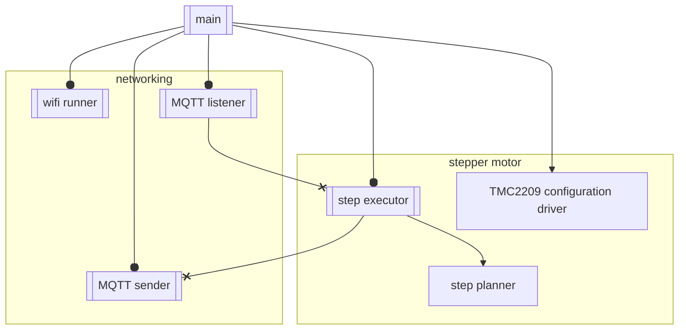
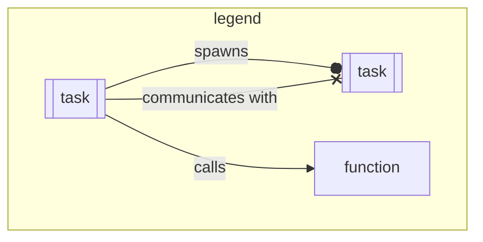

Crabroll is built on top of [Embassy](https://embassy.dev/) and [esp-hal](https://github.com/esp-rs/esp-hal).

It uses the embassy networking stack and [rust-mqtt](https://github.com/obabec/rust-mqtt) to manage communication with home assistant.
It uses a custom stepper motor driver (which will eventually be split into a standalone crate) to drive a stepper motor with a tmc2209 stepper motor driver.

Main spawns all tasks,
and does the inital hardware setup, as well as allocating resources and channels on the stack for communication between tasks.

Roughly, the architcture looks like:

