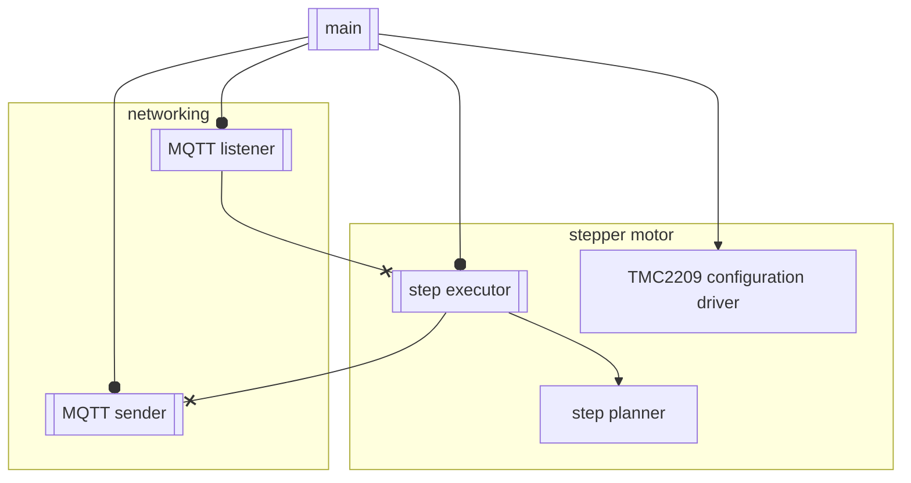
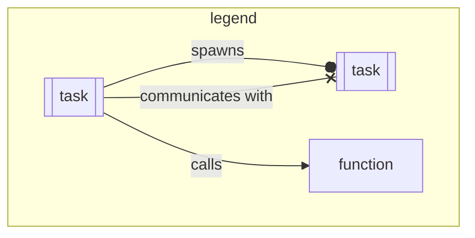

Crabroll is built on top of [Embassy](https://embassy.dev/) and [esp-hal](https://github.com/esp-rs/esp-hal).

It uses the embassy networking stack and [rust-mqtt](https://github.com/obabec/rust-mqtt) to manage communication with home assistant.
It uses a custom stepper motor driver (which will eventually be split into a standalone crate) to drive a stepper motor with a tmc2209 stepper motor driver.

Roughly, the architecture looks like:

Main spawns all tasks,
and does the initial hardware setup, as well as allocating resources and channels on the stack for communication between tasks.
Main also sets up the network stack, 

MQTT listener subscribes to relevant MQTT topics from home assistant,
and sends commands as needed to the step executor.
After all initialization is done, main is also responsible for the devices physical UI,
its 4 buttons and 2 LEDs.

MQTT sender is responsible for sending status updates to home assistant,
via publishing changes to things like step position to MQTT.

The step executor is a high-priority task that is responsible for the toggling of the TMC2209's step and dir pins.
It takes the target position from the MQTT listener,
and through calling the step planner's `next_step()` method,
toggles the step pin at the correct timings to accelerate and decelerate the motor.

The step planner is a 'plain' struct with non-blocking, non-async methods,
which calculates acceleration curves for motor moves.
(TODO: Does the step planner store the motors current position and generate steps by getting a new target position,
or is it 'dumb', and only deal with relative moves?
If it is not dumb, the step planner could enable features like interrupting moves smoothly.)

The TMC2209 configuration driver is an abstraction layer over the tmc2209's uart interface.
It is a bitfield based struct allowing configuration of things like microstepping, silent modes, and power saving modes.
It is a struct with async methods, which owns the uart interface connected to the TMC2209.
