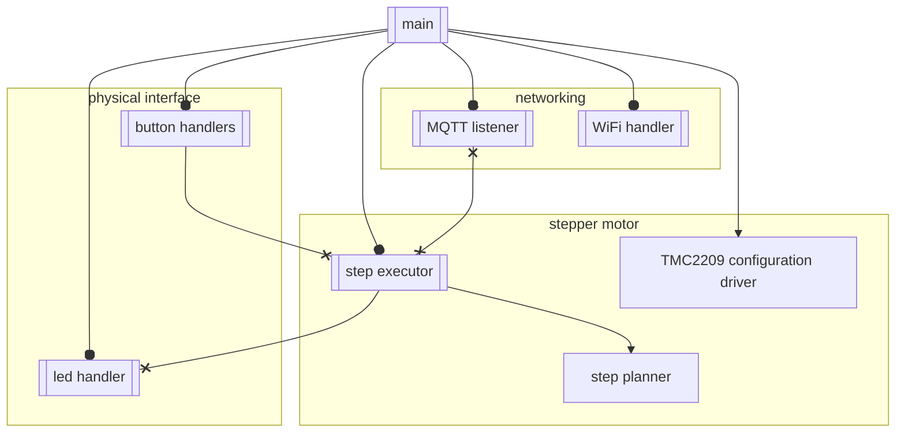
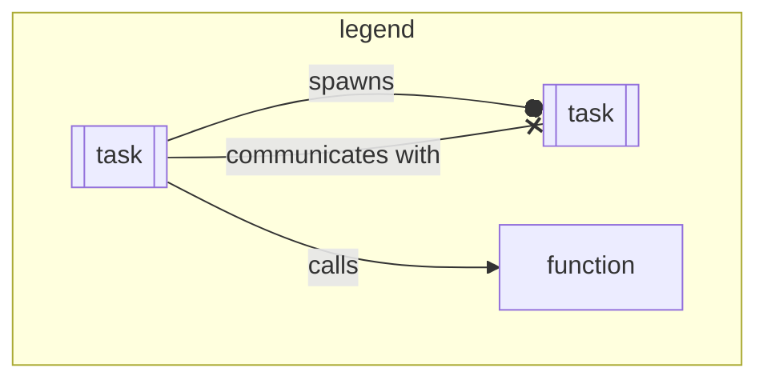

Crabroll is built on top of [Embassy](https://embassy.dev/) and [esp-hal](https://github.com/esp-rs/esp-hal).

It uses the embassy networking stack and [rust-mqtt](https://github.com/obabec/rust-mqtt) to manage communication with home assistant.
It uses a custom stepper motor driver (which will eventually be split into a standalone crate) to drive a stepper motor with a tmc2209 stepper motor driver.

Roughly, the architecture looks like:

Main spawns all tasks,
and does the initial hardware setup,
as well as allocating resources and signals on the stack for communication between tasks.
Main also sets up the network stack.

The MQTT handler subscribes to relevant MQTT topics from home assistant,
sends commands as needed to the step executor,
and listens to position updates from teh step executor in order to publish MQTT position updates.

The wifi handler simply connects to wifi and attempts to reconnect whenever that connection is lost.

The step executor is a high-priority task that is responsible for the toggling of the TMC2209's step and dir pins.
It takes the target position from the MQTT listener,
and through iterating through the step planners step delays,
toggles the step pin at the correct timings to accelerate and decelerate the motor.

The step planner is a 'plain' struct with non-blocking, non-async methods,
which calculates acceleration curves for motor moves.

The TMC2209 configuration driver is an abstraction layer over the tmc2209's uart interface.
It is a bitfield based struct allowing configuration of things like microstepping, silent modes, and power saving modes.
It is a struct with async methods, which owns the uart interface connected to the TMC2209.
